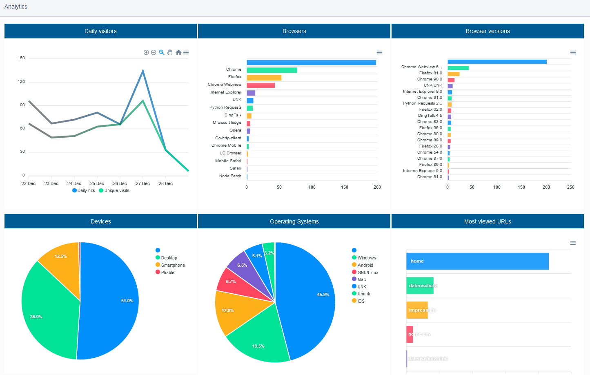

# Analytics for Silverstripe
## Currently in beta

<br>


## Introduction

This module enables basic analytics in Silverstripe without saving identifying data.



## Requirements

* silverstripe/framework ^4.0
* silverstripe/admin ^1.0

This module was only tested on >= 4.9.

## Installation

```
composer require zazama/analytics
```

After a /dev/build, the module will start logging requests. You can find an overview of the data at /admin/analytics.

**ATTENTION: Please read through "[Garbage Collection](#garbage-collection)" if you don't want your database to grow infinitely.**

## How does it work?

- On every request, a user sends its User-Agent string to the server. Using a middleware and matomo/device-detector, we can parse it and check which browser/device it is or if it's a bot.
- This information is stored in the database together with [other collected analytics](#which-information-is-stored).
- On first visit of a user, we write a note into the session to be able to mark it as unique.
- In order to filter out as many bots as possible, we don't save any request with an unknown User-Agent. To optimize bot detection, use [image verification](#improve-bot-detection-by-using-image-verification).<br />Also, some routes are automatically skipped, e.g. UserDefinedFormController/ping, /admin/* or /dev/*, see "[When is no information stored?](#When-is-no-information-stored)".

## Improve bot detection by using image verification
While removing unknown User-Agents already takes away a fair share of bots, there are still many crawlers that just call your website without loading its content.

In order to remove them from the statistics, you can insert an image tracking code by activating it with the following configuration.

```yaml
Zazama\Analytics\Middlewares\AnalyticsProcessorMiddleware:
  image_verification: true
  secret_key: 'InsertARandomEncryptionKeyHere'
```

The secret key is used in order to verify that the inserted image link is not forged or makes any information public.

This method works by inserting a hidden `` tag before `</body>` on every valid tracking request. If a user loads the image, the request will be marked as verified in the database, otherwise it will be filtered.

## Garbage Collection
After some time, your database will fill up with too many requests that you might not care about anymore (e.g. very old ones, unverified).

Use the task `/dev/tasks/AnalyticsGarbageCollectionTask` in order to delete them.

You should do this automatically, by using a cron job or, if that's not possible, by activating the Garbage Collection every xth request via the middleware.

```yaml
Zazama\Analytics\Middlewares\AnalyticsProcessorMiddleware:
  # Run AnalyticsGarbageCollectionTask with probability of 1/100
  # => ~ every 100 requests. (Default: 0, off)
  gc_divisor: 100
  # Delete requests older than (default) 365 days.
  preserve_for_days: 365
```

Only do this if the amount of requests you collect is reasonably small, otherwise the DELETE query might take uncomfortably long for the visitor.

## Which information is stored?
- Current date
- Requested url
- Operating System with version
- Browser with version
- Device type (desktop, smartphone etc.)
- Unique visit
- SiteTreeID (PageID) if possible

## When is no information stored?
- Unidentifiable/Bot User-Agents
- Status codes that are not between 200-204 due to bots spamming /wp-* etc.
- Admin backend urls
- Security urls / Controller
- DevelopmentAdmin Controller (/dev urls)
- UserDefinedFormController/ping